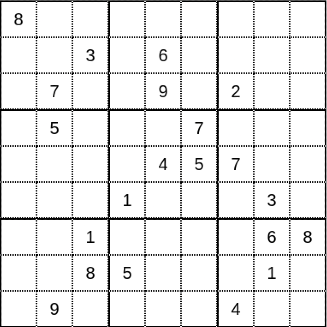
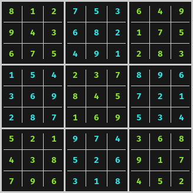
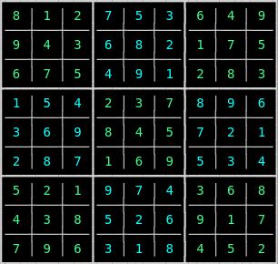

# Resolviendo sudokus con PHP

> Demostración de cómo resolver sudokus con PHP

[TOC]

## Qué son los sudokus

Los sudokus son pasatiempos que consisten en completar con números del 1 al 9 una cuadrícula de 81 casillas y 9 subcuadrículas, de forma que no se repita ningún número en la misma fila o columna ni en la misma subcuadrícula.

### Reglas de los sudokus

- La cuadrícula del sudoku tiene 9x9 celdas.
- Solo puedes usar los números del 1 al 9.
- Cada bloque o cuadrante de 3x3 solo puede contener números del 1 al 9.
- Cada columna vertical solo puede contener números del 1 al 9.
- Cada fila horizontal solo puede contener números del 1 al 9.
- Cada número de un cuadrante de 3x3, de una columna o de una fila solo puede usarse una vez.
- Un sudoku sólo puede tener una única solución.
- La partida acaba cuando se completa toda la cuadrícula del sudoku.

## Sobre esta aplicación

Esta aplicación permite resolver sudokus mediante una implementación con PHP y que permite mostrar la solución del mismo directamente en la terminal de línea de comandos, así como en una página HTML mediante una petición HTTP.

> Esta aplicación está basada en [Simple sudoku solver](https://jsbin.com/sohudezihi/edit?js,output), una implementación con Javascript escrita por [Andrei Kashcha](https://twitter.com/anvaka) y vista en la entrada [Programa JS para resolver sudokus](https://www.microsiervos.com/archivo/ordenadores/programa-javascript-resolver-sudokus.html) de [Microsiervos](https://microsiervos.com).

> A diferencia de la implementación con Javascript, la elección de los números candidatos para analizar cada opción **no se obtienen por fuerza bruta** sino que se analiza cada fila, columna y cuadrante para calcular las posibles opciones correctas; reduciendo así la complejidad algorítmica y optimizando los tiempos de respuesta al eliminar todas aquellas combinaciones con números que atentan contra las reglas del sudoku.

Esta aplicación podrá dar como resultado:

- Una excepción de tipo `WrongSchemaException` si el mapa de entrada no cumple con el tamaño correcto o bien, contiene símbolos no permitidos.

O bien,

- Una excepción de tipo `CannotBeSolvedException` si el mapa de entrada no cumple con las reglas de los sudokus. Por ejemplo, cuando se introducen números repetidos en la misma fila, columna o área y, por tanto, es imposible de resolver el sudoku.

O bien,

- La solución del sudoku.

Hay dos modos de usar la aplicación:

### Command Line Interface (CLI)

En [`./cli/example.php`](https://github.com/AlcidesRC/sudoku-solver-in-php/blob/main/src/cli/example.php) se encuentra un ejemplo de uso mediante la interfaz de línea de comandos.

#### Ejecutar el ejemplo

```bash
demos-sudoku$ make example-cli
```

##### Resultado

|  Entrada                         | Resultado                      |
|:--------------------------------:|:------------------------------:|
|  |  |

### HTML

De manera análoga, en [`./public/index.php`](https://github.com/AlcidesRC/sudoku-solver-in-php/blob/main/src/public/index.php) se encuentra un ejemplo de uso mediante HTTP.

#### Ejecutar el ejemplo

```bash
demo-sudoku$ make example-html
```

##### Resultado

|  Entrada                         | Resultado                       |
|:--------------------------------:|:-------------------------------:|
|  |  |

## Construído con

* [Docker](https://www.docker.com/) - La manera más rápida de crear aplicaciones en contenedores.
* [nginx](https://www.nginx.com/) - Servidor web, balanceador de carga avanzado y reverse proxy todo en uno.
* [PHP-FPM](https://www.php.net/) - Lenguaje de programación generalista que está especialmente diseñado para el desarrollo web.
* Make - Utilidad make GNU para mantener grupos de programas.

## Requisitos

- Docker
- Git
- Navegador web (para el ejemplo en HTML)

## Consideraciones

Para simplificar la puesta en marcha, la aplicación responde por defecto al endpoint `http://localhost`

## Instalación

Para instalar esta aplicación basta con clonar el proyecto en local:

```bash
$ cd ~ && mkdir -p demos/sudoku-solver-in-php
~demos/sudoku-solver-in-php$ git clone https://github.com/AlcidesRC/sudoku-solver-in-php
```

## Uso

La aplicación cuenta con un Makefile que contiene todos los comandos útiles para su puesta en marcha:

### Comandos disponibles

```bash
~demos/sudoku-solver-in-php$ make

╔══════════════════════════════════════════════════════════════════════════════╗
║                                                                              ║
║                           .: AVAILABLE COMMANDS :.                           ║
║                                                                              ║
╚══════════════════════════════════════════════════════════════════════════════╝

· build                          Builds the service
· down                           Stops the service
· logs                           Exposes the service logs
· restart                        Restarts the service
· up                             Starts the service
· bash                           Opens a Bash terminal with main service
· composer-install               Runs <composer install>
· composer-update                Runs <composer update>
· composer-require               Runs <composer require>
· composer-require-dev           Runs <composer require>
· composer-remove                Runs <composer remove>
· composer-dump                  Runs <composer dump-auto>
· qa                             Checks the source code
· tests                          Runs the Tests Suites
· metrics                        Generates a report with some metrics
· cli                            Executes the example via CLI
· html                           Executes the example via HTTP
```

### Construcción del servicio

```bash
~demos/sudoku-solver-in-php$ make build
```

### Iniciando el servicio

```bash
~demos/sudoku-solver-in-php$ make up
```

### Instalando las dependencias

```bash
~demos/sudoku-solver-in-php$ make composer-install
```

### Accediendo al servicio mediante Bash

```bash
~demos/sudoku-solver-in-php$ make bash
```

### Análisis de Calidad (Quality Assurance)

Este comando ejecuta las siguientes herramientas:

- PHP Linter
- PHP Coding Standards Fixer (PHP-CS-Fixer)
- PHP Static Analyser (PHPStan)

```bash
~demos/sudoku-solver-in-php$ make qa
```

### Ejecución de baterías de pruebas

Este comando ejecuta las siguientes herramientas:

- PHP Unit
- PHP Coverage (PHPCOV)
- Infection

```bash
~demos/sudoku-solver-in-php$ make tests
```

> El informe de cobertura de código se encuentra en `./coverage/html/index.html`

### Generación de métricas

```bash
~demos/sudoku-solver-in-php$ make metrics
```

> El informe de métricas se encuentra en `./metrics/index.html`

### Parando el servicio

```bash
~demos/sudoku-solver-in-php$ make down
```
